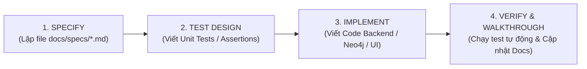

# 📐 SPEC-DRIVEN DEVELOPMENT & AGENTIC WORKFLOW RULES (SPECKIT)

Bộ quy tắc bắt buộc này thiết lập phương pháp luận **Phát triển dựa trên Đặc tả kỹ thuật (Spec-Driven Development - SDD)** và các kỹ năng **Agentic Superpowers** cho mọi tác vụ phát triển tính năng mới trong dự án **AdmissionKG**.

---

## 🎯 1. NGUYÊN TẮC BẤT BIẾN (CORE INVARIANTS)

1. **NO CODE WITHOUT SPEC (Không code khi chưa có Đặc tả)**:
   - Trước khi triển khai một Feature/Epic/Service mới, BẮT BUỘC phải lập tệp Đặc tả kỹ thuật chuẩn tại thư mục `docs/specs/` theo mẫu [spec_template.md](../templates/spec_template.md).
   - Tuyệt đối không nhảy vào code ngay khi chưa chốt DTO Contracts, Schema và Acceptance Criteria.

2. **TEST-FIRST & VERIFICATION (Kiểm thử trước / TDD)**:
   - Đối với các module logic tính toán (như Three-Way Decision, Điểm tổ hợp, Điểm ưu tiên, Cypher Query Router): Phải viết Unit Test (JUnit 5 / Vitest) để định nghĩa trước hành vi mong đợi.
   - Mã nguồn triển khai chỉ được coi là hoàn thành khi 100% Tests Pass và `mvn test` / `npm run build` không có lỗi.

3. **TOKEN CONSERVATION & CONTEXT HYGIENE (Tối ưu hóa Token)**:
   - **Spec-Anchoring**: Trong các prompt tiếp theo, chỉ dẫn chiếu link file đặc tả (`docs/specs/...`), không lặp lại toàn bộ yêu cầu dài dòng.
   - **Slicing**: Sử dụng công cụ `view_file` theo khoảng dòng (`StartLine` - `EndLine`), tuyệt đối không đọc toàn bộ file lớn nếu chỉ cần sửa 1 hàm.
   - **Local Edits**: Sử dụng `replace_file_content` cho các khối sửa đổi chính xác, không ghi đè toàn bộ file mã nguồn.

---

## 🔄 2. QUY TRÌNH 4 BƯỚC PHÁT TRIỂN CHUẨN (4-STEP SDD WORKFLOW)



### Bước 1: SPECIFY (Lập tài liệu Đặc tả)
* Tạo tệp `docs/specs/[EPIC_NAME]_SPEC.md` với đầy đủ:
  * **User Stories & Business Rules**: Ràng buộc nghiệp vụ rõ ràng.
  * **Data Contracts**: Entity, DTO (Request/Response), Cypher Graph Schema.
  * **API Endpoints**: Method, Path, Status Codes, Error Envelope.
  * **Edge Cases & Invariants**: Các trường hợp biên và điều kiện bắt buộc.
  * **Acceptance Criteria**: Ma trận kiểm thử (Given - When - Then).

### Bước 2: TEST DESIGN (Thiết kế Kiểm thử)
* Viết các Test Cases đại diện cho:
  * Luồng chuẩn (Happy Path).
  * Các trường hợp biên (Corner Cases: điểm chạm sàn 15.0, điểm tối đa 30.0, khuyết điểm, sai tổ hợp).
  * Bất biến an toàn (Safety Invariants: không bao giờ khuyên 100% NV rủi ro).

### Bước 3: IMPLEMENT (Triển khai Mã nguồn)
* Tuân thủ kiến trúc mô-đun:
  * Backend: Spring Boot 3.x (Controller $\rightarrow$ Service $\rightarrow$ Repository / Neo4jClient).
  * Frontend: React Vite Modular Architecture (Component $\le 250$ dòng, CSS Modules).

### Bước 4: VERIFY & WALKTHROUGH (Nghiệm thu)
* Chạy kiểm thử tự động (`mvn test` / `npm run build`).
* Cập nhật tệp `walkthrough.md` hoặc tài liệu liên quan ghi nhận kết quả và mã kiểm thử đã hoàn thành.

---

## 📂 3. CẤU TRÚC THƯ MỤC SPECS

```
docs/specs/
├── README.md                           # Danh mục theo dõi tiến độ các Specs
├── EPIC_1_TWD_CORE_ENGINE_SPEC.md      # Đặc tả Epic 1: TWD Engine & Scoring
├── EPIC_2_GRAPH_RETRIEVAL_SPEC.md      # Đặc tả Epic 2: Neo4j Cypher & RAG
├── EPIC_3_DECISION_RAG_PIPELINE_SPEC.md# Đặc tả Epic 3: DeepSeek Prompt & SSE
└── EPIC_4_SMART_WISHLIST_SPEC.md       # Đặc tả Epic 4: UI Dashboard & Kéo thả NV
```
