# Thiết Kế CSDL Tuyển Sinh (Admission Database Schema)

Tài liệu này lưu trữ sơ đồ quan hệ thực thể (ERD) và từ điển dữ liệu (Data Dictionary) được thiết kế cho hệ thống AdmissionKG, hỗ trợ quản lý cấu trúc tổ chức, chương trình đào tạo, quy tắc xét tuyển, ma trận tổ hợp - môn thi, hồ sơ thí sinh và bộ máy đánh giá TWD (Three-Way Decision).

---

## 📊 1. Sơ đồ Thực thể Quan hệ (Mermaid ER Diagram)

```mermaid
erDiagram
    %% =========================================================
    %% 1. TỔ CHỨC & ĐÀO TẠO
    %% =========================================================
    INSTITUTIONS ||--o{ CAMPUSES : "operates (1:N)"
    INSTITUTIONS ||--o{ INSTITUTIONS : "parent_of (ĐHQG/ĐH Vùng)"
    INSTITUTIONS ||--o{ ADMISSION_SCHEMES : "publishes (1:N)"
    INSTITUTIONS ||--o{ UNIVERSAL_CONVERSIONS : "configures (1:N)"
    INSTITUTIONS ||--o{ BONUS_POLICIES : "defines (1:N)"
    
    ACADEMIC_FIELDS ||--o{ MAJORS : "contains (1:N)"
    MAJORS ||--o{ ADMISSION_TRACKS : "referenced_by (1:N)"
    CAMPUSES ||--o{ ADMISSION_TRACKS : "hosts (1:N)"
    ADMISSION_SCHEMES ||--o{ ADMISSION_TRACKS : "includes (1:N)"

    %% =========================================================
    %% 2. NGHỀ NGHIỆP & ĐỊNH HƯỚNG
    %% =========================================================
    ADMISSION_TRACKS ||--o{ TRACK_CAREER_MAPPING : "maps_to"
    CAREERS ||--o{ TRACK_CAREER_MAPPING : "mapped_from"

    %% =========================================================
    %% 3. QUY TẮC, CÔNG THỨC & TIÊU CHÍ PHỤ
    %% =========================================================
    ADMISSION_TRACKS ||--o{ TRACK_ELIGIBILITY_RULES : "enforces_gatekeeper (1:N)"
    ADMISSION_TRACKS ||--o{ TRACK_TIE_BREAKERS : "defines_tie_breakers (1:N)"
    ADMISSION_METHODS ||--o{ TRACK_ELIGIBILITY_RULES : "applies_to"
    ADMISSION_METHODS ||--o{ TRACK_TIE_BREAKERS : "applies_to"

    %% =========================================================
    %% 4. TỔ HỢP, MÔN THI & MA TRẬN XÉT TUYỂN
    %% =========================================================
    SUBJECT_COMBINATIONS ||--o{ COMBINATION_SUBJECTS : "composed_of (1:N)"
    SUBJECTS ||--o{ COMBINATION_SUBJECTS : "part_of (1:N)"

    ADMISSION_TRACKS ||--o{ TRACK_METHOD_COMBINATIONS : "offers (1:N)"
    ADMISSION_METHODS ||--o{ TRACK_METHOD_COMBINATIONS : "used_in (1:N)"
    SUBJECT_COMBINATIONS ||--o{ TRACK_METHOD_COMBINATIONS : "accepts (1:N)"
    SCORE_FORMULAS ||--o{ TRACK_METHOD_COMBINATIONS : "calculates_with (1:N)"

    TRACK_METHOD_COMBINATIONS ||--o{ BENCHMARKS_QUOTAS : "has_history (1:N)"

    %% =========================================================
    %% 5. NGƯỜI DÙNG, HỒ SƠ & ĐÁNH GIÁ TWD
    %% =========================================================
    USERS ||--o{ USER_ACADEMIC_PROFILES : "owns (1:N)"
    USERS ||--o{ USER_WISHES : "creates (1:N)"
    USER_ACADEMIC_PROFILES ||--o{ USER_WISHES : "evaluates_with (1:N)"
    TRACK_METHOD_COMBINATIONS ||--o{ USER_WISHES : "selected_in (1:N)"
    USER_WISHES ||--o{ TWD_EVALUATION_LOGS : "produces_risk_zone (1:1)"

    %% =========================================================
    %% CHI TIẾT THUỘC TÍNH CÁC THỰC THỂ (DATA DICTIONARY)
    %% =========================================================
    INSTITUTIONS {
        varchar institution_id PK "Mã định danh (DQN, HTC, YKV)"
        varchar institution_code UK "Mã trường Bộ GD&ĐT"
        varchar institution_name "Tên trường / Học viện"
        varchar institution_type "Đại học / Học viện / ĐHQG"
        varchar parent_institution_id FK "Trường cha (ĐHQG)"
        jsonb contact_info "Hotline, email, website"
    }

    CAMPUSES {
        varchar campus_id PK "Mã cơ sở (HTC_HN, HTS_HCM, HTY)"
        varchar institution_id FK "Thuộc trường nào"
        varchar campus_code "Mã phân hiệu tuyển sinh"
        varchar campus_name "Tên cơ sở / Phân hiệu"
        varchar province_city "Tỉnh/Thành phố"
        varchar region "Bắc / Trung / Nam"
    }

    ACADEMIC_FIELDS {
        varchar field_code PK "Mã khối ngành (748, 772, 734)"
        varchar field_name "Tên khối ngành"
    }

    MAJORS {
        varchar major_code PK "Mã ngành chuẩn (7480103, 7720101)"
        varchar field_code FK "Thuộc khối ngành"
        varchar major_name "Tên ngành đào tạo"
        varchar degree_type "Cử nhân / Kỹ sư / Bác sĩ"
    }

    ADMISSION_SCHEMES {
        varchar scheme_id PK "Mã đề án (DQN_2026, HTC_2026)"
        varchar institution_id FK "Trường ban hành"
        int academic_year "Năm tuyển sinh (2026)"
        int total_quota "Tổng chỉ tiêu trường"
    }

    ADMISSION_TRACKS {
        varchar track_id PK "Mã chương trình (HTC_2026_HC0201QT)"
        varchar scheme_id FK "Thuộc đề án năm"
        varchar campus_id FK "Địa điểm đào tạo"
        varchar major_code FK "Mã ngành chuẩn Bộ"
        varchar admission_code "Mã ĐKXT (HC0201QT, 7480103)"
        varchar track_name "Tên CTĐT (Kế toán ACCA, Y khoa)"
        varchar track_type "Chuẩn / CLC / Quốc tế / Sư phạm"
        varchar orientation_cert "ACCA / CMA / ICAEW / FIATA"
        jsonb tuition_policy "Mức học phí & lộ trình"
        int allocated_quota "Chỉ tiêu của riêng mã này"
    }

    ADMISSION_METHODS {
        varchar method_id PK "Mã PT (PT100, PT200, PT_KETHOP)"
        varchar method_code "100, 200, 301, 402, 500"
        varchar method_name "Tên phương thức"
        varchar target_group "THPT / Học bạ / ĐGNL"
    }

    SUBJECTS {
        varchar subject_code PK "TOAN, LY, HOA, ANH, TIN, GDCD_KTPL"
        varchar subject_name "Tên môn học / môn thi"
        varchar subject_category "Văn hóa / Năng khiếu / ĐGNL"
    }

    SUBJECT_COMBINATIONS {
        varchar combination_code PK "A00, B00, D01, D07, X06, X26"
        varchar combination_name "Danh sách môn tổ hợp"
    }

    COMBINATION_SUBJECTS {
        varchar combination_code PK "Mã tổ hợp (FK)"
        varchar subject_code PK "Mã môn (FK)"
    }

    SCORE_FORMULAS {
        int formula_id PK "ID công thức"
        varchar formula_code UK "THPT_SCALE30, THPT_SCALE40_MATH_X2"
        numeric target_scale "Thang chuẩn hóa (30.0)"
        text formula_expression "Biểu thức toán học tính điểm"
        jsonb subject_weights "Trọng số từng môn {'TOAN': 2.0}"
    }

    TRACK_METHOD_COMBINATIONS {
        int tmc_id PK "ID liên kết"
        varchar track_id FK "Mã chương trình tuyển sinh"
        varchar method_id FK "Mã phương thức"
        varchar combination_code FK "Mã tổ hợp môn"
        int formula_id FK "Công thức tính điểm áp dụng"
        int specific_quota "Chỉ tiêu riêng phân bổ"
    }

    BENCHMARKS_QUOTAS {
        int benchmark_id PK "ID điểm chuẩn"
        int tmc_id FK "Liên kết Track-Method-Comb"
        int academic_year "Năm xét tuyển (2024, 2025, 2026)"
        int quota "Chỉ tiêu năm đó"
        int admitted_count "Số nhập học thực tế"
        numeric benchmark_score "Điểm chuẩn trúng tuyển"
        numeric score_scale "Thang điểm (30 / 40)"
    }

    TRACK_ELIGIBILITY_RULES {
        int rule_id PK "ID điều kiện"
        varchar track_id FK "Mã chương trình"
        varchar method_id FK "Phương thức áp dụng"
        varchar rule_type "Học lực 12 / Sức khỏe / Điểm sàn môn"
        jsonb rule_value "Ngưỡng giá trị {'min_math': 6.0}"
        text error_message_vi "Thông báo vi phạm điều kiện"
    }

    TRACK_TIE_BREAKERS {
        int tie_breaker_id PK "ID tiêu chí phụ"
        varchar track_id FK "Mã chương trình"
        int priority_order "Thứ tự ưu tiên (1, 2, 3)"
        varchar criterion_type "Điểm Toán / Điểm cộng thấp / NV"
        varchar sort_direction "ASC / DESC"
    }

    UNIVERSAL_CONVERSIONS {
        int conversion_id PK "ID quy đổi"
        varchar institution_id FK "Áp dụng cho trường (hoặc NULL)"
        varchar cert_or_achievement_type "IELTS / VSTEP / SAT / HSG"
        varchar min_input_value "6.5 / 1450 / B2 / GIAI_NHI"
        varchar action_type "REPLACE_SCORE / ADD_BONUS / GATE"
        numeric converted_score "Điểm môn quy đổi (9.5)"
        numeric bonus_point "Điểm cộng khuyến khích (+1.0)"
    }

    BONUS_POLICIES {
        int policy_id PK "ID chính sách ưu tiên"
        varchar institution_id FK "Thuộc trường"
        varchar achievement_category "HSG Quốc gia / KHKT / Thể thao"
        varchar prize_level "Giải Nhất / Nhì / Ba / Khuyến khích"
        numeric bonus_points "+3.0 / +2.0 / +1.0"
        numeric max_accumulated_bonus "Trần điểm cộng tối đa (3.0)"
    }

    CAREERS {
        varchar career_id PK "SOFTWARE_ENGINEER, ACCA_AUDITOR"
        varchar career_title "Tên vị trí nghề nghiệp"
        varchar industry "Ngành nghề / Lĩnh vực"
        jsonb required_skills "Kỹ năng yêu cầu"
    }

    TRACK_CAREER_MAPPING {
        varchar track_id PK "Mã chương trình đào tạo (FK)"
        varchar career_id PK "Mã nghề nghiệp (FK)"
        numeric suitability_score "Độ phù hợp (0.0 - 1.0)"
    }

    USERS {
        int user_id PK "ID người dùng"
        varchar email UK "Email đăng nhập"
        varchar full_name "Họ và tên thí sinh"
        varchar identity_card_number "Số CCCD"
    }

    USER_ACADEMIC_PROFILES {
        int profile_id PK "ID hồ sơ điểm"
        int user_id FK "Thuộc người dùng"
        jsonb thpt_scores "Điểm thi THPT 2026"
        jsonb hocba_scores "Điểm học bạ 3 năm THPT"
        jsonb aptitude_test_scores "Điểm ĐGNL HCM / ĐHQG HN"
        jsonb international_certificates "IELTS, SAT, VSTEP..."
        jsonb achievements "Giải HSG, giải KHKT..."
        varchar priority_area "Khu vực ưu tiên (KV1, KV2, KV3)"
        varchar priority_group "Đối tượng chính sách (01, 02...)"
    }

    USER_WISHES {
        int wish_id PK "ID nguyện vọng"
        int user_id FK "Thí sinh đăng ký"
        int profile_id FK "Sử dụng hồ sơ điểm nào"
        int wish_order "Thứ tự NV (1, 2, 3...)"
        int tmc_id FK "Mã xét tuyển & Tổ hợp chọn"
    }

    TWD_EVALUATION_LOGS {
        int log_id PK "ID log TWD"
        int wish_id FK "Thuộc nguyện vọng"
        numeric final_admission_score "Điểm xét sau quy đổi & ưu tiên"
        varchar twd_risk_zone "POS (An toàn) / BND (Vừa sức) / NEG (Rủi ro)"
        numeric safety_margin "Độ chênh lệch với điểm chuẩn lịch sử"
        varchar eligibility_status "QUALIFIED / DISQUALIFIED"
        text recommendation_strategy "Khuyến nghị điều chỉnh thứ tự NV"
    }
```

---

## 📑 2. Phân nhóm Thực thể (Logical Grouping)

1. **Tổ chức & Đào tạo (Institutional & Academic Hierarchy)**:
   - `INSTITUTIONS`: Danh sách trường/học viện/ĐHQG.
   - `CAMPUSES`: Cơ sở, phân hiệu tuyển sinh của trường.
   - `ACADEMIC_FIELDS`: Khối ngành đào tạo (mã nhóm ngành chuẩn Bộ).
   - `MAJORS`: Ngành đào tạo chuẩn.
   - `ADMISSION_SCHEMES`: Đề án tuyển sinh theo từng năm của trường.
   - `ADMISSION_TRACKS`: Chương trình tuyển sinh chi tiết (chuẩn, CLC, quốc tế...).

2. **Nghề nghiệp & Định hướng (Career Orientation)**:
   - `CAREERS`: Danh mục vị trí nghề nghiệp, kỹ năng cần thiết.
   - `TRACK_CAREER_MAPPING`: Bảng ánh xạ độ tương thích giữa chương trình tuyển sinh và nghề nghiệp.

3. **Quy tắc, Công thức & Tiêu chí phụ (Eligibility, Formulas & Tie-breakers)**:
   - `ADMISSION_METHODS`: Phương thức tuyển sinh (PT100, PT200...).
   - `TRACK_ELIGIBILITY_RULES`: Quy tắc điều kiện sàn (gatekeeper) cho từng chương trình/phương thức.
   - `TRACK_TIE_BREAKERS`: Tiêu chí phụ khi xét hòa điểm.
   - `SCORE_FORMULAS`: Công thức và trọng số tính điểm xét tuyển.
   - `UNIVERSAL_CONVERSIONS`: Bảng quy đổi chứng chỉ ngoại ngữ, giải thưởng.
   - `BONUS_POLICIES`: Chính sách cộng điểm khuyến khích, ưu tiên của từng trường.

4. **Tổ hợp, Môn thi & Ma trận xét tuyển (Combinations & Benchmarks)**:
   - `SUBJECTS`: Danh mục môn học / môn thi.
   - `SUBJECT_COMBINATIONS`: Tổ hợp môn xét tuyển (A00, D01...).
   - `COMBINATION_SUBJECTS`: Chi tiết môn thuộc tổ hợp.
   - `TRACK_METHOD_COMBINATIONS`: Ma trận kết hợp Chương trình - Phương thức - Tổ hợp - Công thức tính điểm.
   - `BENCHMARKS_QUOTAS`: Điểm chuẩn và chỉ tiêu lịch sử qua các năm.

5. **Người dùng, Hồ sơ & Đánh giá TWD (Users & Three-Way Decision)**:
   - `USERS`: Tài khoản thí sinh.
   - `USER_ACADEMIC_PROFILES`: Hồ sơ học tập (điểm thi THPT, học bạ, ĐGNL, chứng chỉ quốc tế, khu vực, đối tượng).
   - `USER_WISHES`: Danh sách nguyện vọng đăng ký của thí sinh.
   - `TWD_EVALUATION_LOGS`: Kết quả tính toán và phân vùng 3 miền quyết định (POS: An toàn, BND: Vừa sức, NEG: Rủi ro).

---

## 📋 3. Chi Tiết Từ Điển Dữ Liệu Dạng Bảng (Data Dictionary Tables)

### Phân hệ 1: Tổ chức & Đào tạo

#### 1. `INSTITUTIONS` (Trường / Học viện / Đại học)
| Tên thuộc tính | Kiểu dữ liệu | Ràng buộc | Diễn giải & Ví dụ |
| :--- | :--- | :--- | :--- |
| `institution_id` | `VARCHAR` | **PK** | Mã định danh nội bộ hệ thống (Ví dụ: `DQN`, `HTC`, `YKV`) |
| `institution_code`| `VARCHAR` | **UK**, NOT NULL | Mã trường theo quy chuẩn của Bộ GD&ĐT (Ví dụ: `BKA`, `QHI`) |
| `institution_name`| `VARCHAR` | NOT NULL | Tên đầy đủ của cơ sở đào tạo (Ví dụ: `Đại học Bách Khoa Hà Nội`) |
| `institution_type`| `VARCHAR` | | Loại hình cơ sở đào tạo (`Đại học`, `Học viện`, `ĐHQG`, `Trường ĐH`) |
| `parent_institution_id` | `VARCHAR` | **FK** -> `INSTITUTIONS(institution_id)` | Trường cha nếu trực thuộc ĐHQG hoặc ĐH Vùng (Có thể NULL) |
| `contact_info` | `JSONB` | | Thông tin liên hệ dạng JSON: hotline, email, website, địa chỉ trụ sở chính |

#### 2. `CAMPUSES` (Cơ sở / Phân hiệu Đào tạo)
| Tên thuộc tính | Kiểu dữ liệu | Ràng buộc | Diễn giải & Ví dụ |
| :--- | :--- | :--- | :--- |
| `campus_id` | `VARCHAR` | **PK** | Mã cơ sở/phân hiệu (Ví dụ: `HTC_HN`, `HTS_HCM`, `HTY`) |
| `institution_id` | `VARCHAR` | **FK** -> `INSTITUTIONS(institution_id)` | Trực thuộc trường/học viện nào |
| `campus_code` | `VARCHAR` | | Mã phân hiệu tuyển sinh của cơ sở |
| `campus_name` | `VARCHAR` | NOT NULL | Tên cơ sở/phân hiệu đào tạo |
| `province_city` | `VARCHAR` | | Tỉnh / Thành phố nơi cơ sở đặt trụ sở |
| `region` | `VARCHAR` | | Vùng miền (`Bắc`, `Trung`, `Nam`) |

#### 3. `ACADEMIC_FIELDS` (Khối ngành Đào tạo)
| Tên thuộc tính | Kiểu dữ liệu | Ràng buộc | Diễn giải & Ví dụ |
| :--- | :--- | :--- | :--- |
| `field_code` | `VARCHAR` | **PK** | Mã khối ngành theo danh mục của Bộ GD&ĐT (Ví dụ: `748`, `772`, `734`) |
| `field_name` | `VARCHAR` | NOT NULL | Tên khối ngành (Ví dụ: `Máy tính và Công nghệ thông tin`, `Sức khỏe`) |

#### 4. `MAJORS` (Ngành Đào tạo Chuẩn)
| Tên thuộc tính | Kiểu dữ liệu | Ràng buộc | Diễn giải & Ví dụ |
| :--- | :--- | :--- | :--- |
| `major_code` | `VARCHAR` | **PK** | Mã ngành chuẩn 7 chữ số của Bộ GD&ĐT (Ví dụ: `7480103`, `7720101`) |
| `field_code` | `VARCHAR` | **FK** -> `ACADEMIC_FIELDS(field_code)` | Khối ngành trực thuộc |
| `major_name` | `VARCHAR` | NOT NULL | Tên ngành đào tạo chuẩn (Ví dụ: `Kỹ thuật phần mềm`, `Y khoa`) |
| `degree_type` | `VARCHAR` | | Bằng cấp tốt nghiệp (`Cử nhân`, `Kỹ sư`, `Bác sĩ`, `Dược sĩ`) |

#### 5. `ADMISSION_SCHEMES` (Đề án Tuyển sinh Hàng năm)
| Tên thuộc tính | Kiểu dữ liệu | Ràng buộc | Diễn giải & Ví dụ |
| :--- | :--- | :--- | :--- |
| `scheme_id` | `VARCHAR` | **PK** | Mã đề án tuyển sinh (Ví dụ: `DQN_2026`, `HTC_2026`) |
| `institution_id` | `VARCHAR` | **FK** -> `INSTITUTIONS(institution_id)` | Trường ban hành đề án |
| `academic_year` | `INT` | NOT NULL | Năm tuyển sinh (Ví dụ: `2026`) |
| `total_quota` | `INT` | | Tổng chỉ tiêu toàn trường công bố trong đề án |

#### 6. `ADMISSION_TRACKS` (Chương trình Tuyển sinh / Mã ĐKXT)
| Tên thuộc tính | Kiểu dữ liệu | Ràng buộc | Diễn giải & Ví dụ |
| :--- | :--- | :--- | :--- |
| `track_id` | `VARCHAR` | **PK** | Mã chương trình chi tiết (Ví dụ: `HTC_2026_HC0201QT`) |
| `scheme_id` | `VARCHAR` | **FK** -> `ADMISSION_SCHEMES(scheme_id)` | Thuộc đề án tuyển sinh năm nào |
| `campus_id` | `VARCHAR` | **FK** -> `CAMPUSES(campus_id)` | Địa điểm/Cơ sở đào tạo |
| `major_code` | `VARCHAR` | **FK** -> `MAJORS(major_code)` | Ngành chuẩn tương ứng theo phân loại Bộ GD&ĐT |
| `admission_code` | `VARCHAR` | NOT NULL | Mã đăng ký xét tuyển của trường (Ví dụ: `HC0201QT`, `7480103`) |
| `track_name` | `VARCHAR` | NOT NULL | Tên chương trình đào tạo (Ví dụ: `Kế toán tích hợp ACCA`, `Y khoa quốc tế`) |
| `track_type` | `VARCHAR` | | Loại chương trình (`Chuẩn`, `Chất lượng cao`, `Quốc tế`, `Sư phạm`) |
| `orientation_cert`| `VARCHAR` | | Chứng chỉ đầu ra / định hướng đào tạo (`ACCA`, `CMA`, `ICAEW`, `FIATA`) |
| `tuition_policy` | `JSONB` | | Chính sách & lộ trình học phí dạng cấu trúc JSON |
| `allocated_quota` | `INT` | | Chỉ tiêu tuyển sinh được phân bổ riêng cho mã chương trình này |

---

### Phân hệ 2: Nghề nghiệp & Định hướng

#### 7. `CAREERS` (Danh mục Nghề nghiệp)
| Tên thuộc tính | Kiểu dữ liệu | Ràng buộc | Diễn giải & Ví dụ |
| :--- | :--- | :--- | :--- |
| `career_id` | `VARCHAR` | **PK** | Mã định danh nghề nghiệp (Ví dụ: `SOFTWARE_ENGINEER`, `ACCA_AUDITOR`) |
| `career_title` | `VARCHAR` | NOT NULL | Tên chức danh/vị trí nghề nghiệp |
| `industry` | `VARCHAR` | | Lĩnh vực / Ngành công nghiệp tương ứng |
| `required_skills` | `JSONB` | | Danh sách kỹ năng, kiến thức yêu cầu đối với vị trí nghề |

#### 8. `TRACK_CAREER_MAPPING` (Ánh xạ Chương trình Đào tạo - Nghề nghiệp)
| Tên thuộc tính | Kiểu dữ liệu | Ràng buộc | Diễn giải & Ví dụ |
| :--- | :--- | :--- | :--- |
| `track_id` | `VARCHAR` | **PK, FK** -> `ADMISSION_TRACKS(track_id)` | Mã chương trình đào tạo |
| `career_id` | `VARCHAR` | **PK, FK** -> `CAREERS(career_id)` | Mã nghề nghiệp |
| `suitability_score`| `NUMERIC` | CHECK (0.0 <= x <= 1.0) | Trọng số / Mức độ tương quan và phù hợp giữa ngành học và nghề nghiệp |

---

### Phân hệ 3: Quy tắc, Công thức & Tiêu chí phụ

#### 9. `ADMISSION_METHODS` (Phương thức Tuyển sinh)
| Tên thuộc tính | Kiểu dữ liệu | Ràng buộc | Diễn giải & Ví dụ |
| :--- | :--- | :--- | :--- |
| `method_id` | `VARCHAR` | **PK** | Mã phương thức nội bộ (Ví dụ: `PT100`, `PT200`, `PT_KETHOP`) |
| `method_code` | `VARCHAR` | NOT NULL | Mã quy định của Bộ GD&ĐT (`100`, `200`, `301`, `402`, `500`...) |
| `method_name` | `VARCHAR` | NOT NULL | Tên phương thức (Ví dụ: `Xét điểm thi tốt nghiệp THPT`, `Xét học bạ kết hợp CCQT`) |
| `target_group` | `VARCHAR` | | Nhóm đối tượng áp dụng (`THPT`, `Học bạ`, `ĐGNL`, `Tuyển thẳng`) |

#### 10. `TRACK_ELIGIBILITY_RULES` (Quy tắc Sàn / Điều kiện Tiên quyết)
| Tên thuộc tính | Kiểu dữ liệu | Ràng buộc | Diễn giải & Ví dụ |
| :--- | :--- | :--- | :--- |
| `rule_id` | `INT` | **PK** (AUTO_INCREMENT / SERIAL) | Mã ID tự tăng của điều kiện sàn |
| `track_id` | `VARCHAR` | **FK** -> `ADMISSION_TRACKS(track_id)` | Chương trình đào tạo áp dụng |
| `method_id` | `VARCHAR` | **FK** -> `ADMISSION_METHODS(method_id)` | Phương thức xét tuyển áp dụng |
| `rule_type` | `VARCHAR` | | Loại điều kiện (`Học lực lớp 12`, `Sức khỏe`, `Điểm sàn môn chính`) |
| `rule_value` | `JSONB` | | Cấu hình ngưỡng kiểm tra (Ví dụ: `{"min_math": 6.0, "min_gpa": 8.0}`) |
| `error_message_vi` | `TEXT` | | Câu thông báo vi phạm điều kiện hiển thị cho thí sinh |

#### 11. `TRACK_TIE_BREAKERS` (Tiêu chí Phụ khi Hòa điểm)
| Tên thuộc tính | Kiểu dữ liệu | Ràng buộc | Diễn giải & Ví dụ |
| :--- | :--- | :--- | :--- |
| `tie_breaker_id` | `INT` | **PK** (AUTO_INCREMENT / SERIAL) | ID tiêu chí phụ |
| `track_id` | `VARCHAR` | **FK** -> `ADMISSION_TRACKS(track_id)` | Chương trình tuyển sinh áp dụng |
| `priority_order` | `INT` | NOT NULL | Mức độ ưu tiên xét trước (`1`, `2`, `3`...) |
| `criterion_type` | `VARCHAR` | NOT NULL | Loại tiêu chí (`Điểm môn Toán`, `Điểm cộng thấp hơn`, `Thứ tự nguyện vọng`) |
| `sort_direction` | `VARCHAR` | DEFAULT 'DESC' | Hướng sắp xếp so sánh (`ASC`, `DESC`) |

#### 12. `SCORE_FORMULAS` (Công thức Tính Điểm Xét tuyển)
| Tên thuộc tính | Kiểu dữ liệu | Ràng buộc | Diễn giải & Ví dụ |
| :--- | :--- | :--- | :--- |
| `formula_id` | `INT` | **PK** (AUTO_INCREMENT / SERIAL) | ID công thức |
| `formula_code` | `VARCHAR` | **UK**, NOT NULL | Mã định danh công thức (Ví dụ: `THPT_SCALE30`, `THPT_SCALE40_MATH_X2`) |
| `target_scale` | `NUMERIC` | NOT NULL | Thang điểm chuẩn hóa đầu ra (Ví dụ: `30.0` hoặc `40.0`) |
| `formula_expression`| `TEXT` | | Biểu thức toán học tính điểm xét tuyển |
| `subject_weights`| `JSONB` | | Trọng số hệ số nhân từng môn dạng JSON (Ví dụ: `{"TOAN": 2.0, "LY": 1.0}`) |

#### 13. `UNIVERSAL_CONVERSIONS` (Bảng Quy đổi Chứng chỉ Ngoại ngữ & Giải thưởng)
| Tên thuộc tính | Kiểu dữ liệu | Ràng buộc | Diễn giải & Ví dụ |
| :--- | :--- | :--- | :--- |
| `conversion_id` | `INT` | **PK** (AUTO_INCREMENT / SERIAL) | ID quy đổi |
| `institution_id` | `VARCHAR` | **FK** -> `INSTITUTIONS(institution_id)` | Trường áp dụng bảng quy đổi này (Nếu NULL nghĩa là áp dụng chung) |
| `cert_or_achievement_type` | `VARCHAR` | NOT NULL | Loại chứng chỉ hoặc giải thưởng (`IELTS`, `VSTEP`, `SAT`, `HSG`) |
| `min_input_value` | `VARCHAR` | NOT NULL | Mức đầu vào tối thiểu để áp dụng quy đổi (Ví dụ: `6.5`, `1450`, `B2`, `GIAI_NHI`) |
| `action_type` | `VARCHAR` | NOT NULL | Hình thức xử lý (`REPLACE_SCORE`, `ADD_BONUS`, `GATE`) |
| `converted_score`| `NUMERIC` | | Điểm môn thi được quy đổi thay thế (Ví dụ: `9.5` cho môn Tiếng Anh) |
| `bonus_point` | `NUMERIC` | | Điểm cộng khuyến khích (Ví dụ: `+1.0`) |

#### 14. `BONUS_POLICIES` (Chính sách Điểm Ưu tiên & Khuyến khích của Trường)
| Tên thuộc tính | Kiểu dữ liệu | Ràng buộc | Diễn giải & Ví dụ |
| :--- | :--- | :--- | :--- |
| `policy_id` | `INT` | **PK** (AUTO_INCREMENT / SERIAL) | ID chính sách ưu tiên |
| `institution_id` | `VARCHAR` | **FK** -> `INSTITUTIONS(institution_id)` | Thuộc trường/học viện ban hành |
| `achievement_category` | `VARCHAR` | NOT NULL | Danh mục thành tích (`HSG Quốc gia`, `KHKT cấp Quốc gia`, `Thể thao`) |
| `prize_level` | `VARCHAR` | NOT NULL | Cấp giải (`Giải Nhất`, `Giải Nhì`, `Giải Ba`, `Khuyến khích`) |
| `bonus_points` | `NUMERIC` | NOT NULL | Số điểm thưởng cộng thêm (`+3.0`, `+2.0`, `+1.0`...) |
| `max_accumulated_bonus`| `NUMERIC` | | Mức trần điểm cộng tối đa được tích lũy (Ví dụ: `3.0`) |

---

### Phân hệ 4: Tổ hợp, Môn thi & Ma trận xét tuyển

#### 15. `SUBJECTS` (Danh mục Môn học & Môn thi)
| Tên thuộc tính | Kiểu dữ liệu | Ràng buộc | Diễn giải & Ví dụ |
| :--- | :--- | :--- | :--- |
| `subject_code` | `VARCHAR` | **PK** | Mã môn (Ví dụ: `TOAN`, `LY`, `HOA`, `ANH`, `TIN`, `GDCD_KTPL`) |
| `subject_name` | `VARCHAR` | NOT NULL | Tên môn học / môn thi |
| `subject_category`| `VARCHAR` | | Phân loại môn (`Văn hóa`, `Năng khiếu`, `ĐGNL`) |

#### 16. `SUBJECT_COMBINATIONS` (Tổ hợp Môn Xét tuyển)
| Tên thuộc tính | Kiểu dữ liệu | Ràng buộc | Diễn giải & Ví dụ |
| :--- | :--- | :--- | :--- |
| `combination_code`| `VARCHAR` | **PK** | Mã tổ hợp môn xét tuyển (Ví dụ: `A00`, `B00`, `D01`, `D07`, `X06`, `X26`) |
| `combination_name`| `VARCHAR` | NOT NULL | Tên gọi hoặc danh sách môn trong tổ hợp |

#### 17. `COMBINATION_SUBJECTS` (Bảng Chi tiết Môn trong Tổ hợp)
| Tên thuộc tính | Kiểu dữ liệu | Ràng buộc | Diễn giải & Ví dụ |
| :--- | :--- | :--- | :--- |
| `combination_code`| `VARCHAR` | **PK, FK** -> `SUBJECT_COMBINATIONS(combination_code)` | Mã tổ hợp |
| `subject_code` | `VARCHAR` | **PK, FK** -> `SUBJECTS(subject_code)` | Mã môn thành phần |

#### 18. `TRACK_METHOD_COMBINATIONS` (Ma trận Chương trình - Phương thức - Tổ hợp)
| Tên thuộc tính | Kiểu dữ liệu | Ràng buộc | Diễn giải & Ví dụ |
| :--- | :--- | :--- | :--- |
| `tmc_id` | `INT` | **PK** (AUTO_INCREMENT / SERIAL) | ID liên kết duy nhất của ma trận xét tuyển |
| `track_id` | `VARCHAR` | **FK** -> `ADMISSION_TRACKS(track_id)` | Chương trình tuyển sinh áp dụng |
| `method_id` | `VARCHAR` | **FK** -> `ADMISSION_METHODS(method_id)` | Phương thức tuyển sinh áp dụng |
| `combination_code`| `VARCHAR` | **FK** -> `SUBJECT_COMBINATIONS(combination_code)` | Tổ hợp môn chấp nhận |
| `formula_id` | `INT` | **FK** -> `SCORE_FORMULAS(formula_id)` | Công thức tính điểm áp dụng |
| `specific_quota` | `INT` | | Chỉ tiêu tuyển sinh phân bổ riêng cho tổ hợp này (hoặc chung) |

#### 19. `BENCHMARKS_QUOTAS` (Lịch sử Điểm chuẩn & Chỉ tiêu Tuyển sinh)
| Tên thuộc tính | Kiểu dữ liệu | Ràng buộc | Diễn giải & Ví dụ |
| :--- | :--- | :--- | :--- |
| `benchmark_id` | `INT` | **PK** (AUTO_INCREMENT / SERIAL) | ID bản ghi điểm chuẩn |
| `tmc_id` | `INT` | **FK** -> `TRACK_METHOD_COMBINATIONS(tmc_id)` | Liên kết tới cặp Track - Phương thức - Tổ hợp |
| `academic_year` | `INT` | NOT NULL | Năm xét tuyển (Ví dụ: `2024`, `2025`, `2026`) |
| `quota` | `INT` | | Chỉ tiêu tuyển sinh được giao của năm đó |
| `admitted_count` | `INT` | | Số lượng thí sinh trúng tuyển/nhập học thực tế |
| `benchmark_score`| `NUMERIC` | NOT NULL | Điểm chuẩn trúng tuyển thực tế của năm |
| `score_scale` | `NUMERIC` | NOT NULL | Thang điểm chuẩn trúng tuyển (`30.0` hoặc `40.0`) |

---

### Phân hệ 5: Người dùng, Hồ sơ & Đánh giá TWD

#### 20. `USERS` (Tài khoản Người dùng / Thí sinh)
| Tên thuộc tính | Kiểu dữ liệu | Ràng buộc | Diễn giải & Ví dụ |
| :--- | :--- | :--- | :--- |
| `user_id` | `INT` | **PK** (AUTO_INCREMENT / SERIAL) | ID người dùng |
| `email` | `VARCHAR` | **UK**, NOT NULL | Email đăng nhập hệ thống |
| `full_name` | `VARCHAR` | NOT NULL | Họ và tên của thí sinh |
| `identity_card_number` | `VARCHAR` | | Số CCCD / CMND |

#### 21. `USER_ACADEMIC_PROFILES` (Hồ sơ Học tập & Kết quả Thi Thí sinh)
| Tên thuộc tính | Kiểu dữ liệu | Ràng buộc | Diễn giải & Ví dụ |
| :--- | :--- | :--- | :--- |
| `profile_id` | `INT` | **PK** (AUTO_INCREMENT / SERIAL) | ID hồ sơ điểm học tập |
| `user_id` | `INT` | **FK** -> `USERS(user_id)` | Thuộc người dùng nào |
| `thpt_scores` | `JSONB` | | Điểm thi tốt nghiệp THPT dạng JSON (Ví dụ: `{"TOAN": 8.6, "LY": 9.0}`) |
| `hocba_scores` | `JSONB` | | Điểm học bạ THPT (lớp 10, 11, 12) theo từng môn |
| `aptitude_test_scores` | `JSONB` | | Kết quả bài thi ĐGNL (ĐHQG HCM, ĐHQG HN, ĐH Sư Phạm...) |
| `international_certificates` | `JSONB` | | Chứng chỉ quốc tế (IELTS, SAT, ACT, VSTEP...) |
| `achievements` | `JSONB` | | Danh sách giải thưởng HSG Quốc gia, KHKT, giải thể thao |
| `priority_area` | `VARCHAR` | | Khu vực ưu tiên tuyển sinh (`KV1`, `KV2`, `KV2-NT`, `KV3`) |
| `priority_group`| `VARCHAR` | | Đối tượng chính sách ưu tiên (`01`, `02`, `03`...) |

#### 22. `USER_WISHES` (Danh sách Nguyện vọng Đăng ký Xét tuyển)
| Tên thuộc tính | Kiểu dữ liệu | Ràng buộc | Diễn giải & Ví dụ |
| :--- | :--- | :--- | :--- |
| `wish_id` | `INT` | **PK** (AUTO_INCREMENT / SERIAL) | ID nguyện vọng |
| `user_id` | `INT` | **FK** -> `USERS(user_id)` | Thí sinh sở hữu nguyện vọng |
| `profile_id` | `INT` | **FK** -> `USER_ACADEMIC_PROFILES(profile_id)` | Hồ sơ điểm được chọn để tính điểm cho NV này |
| `wish_order` | `INT` | NOT NULL | Thứ tự ưu tiên của nguyện vọng (`1`, `2`, `3`...) |
| `tmc_id` | `INT` | **FK** -> `TRACK_METHOD_COMBINATIONS(tmc_id)` | Cặp Track - Phương thức - Tổ hợp môn được thí sinh lựa chọn |

#### 23. `TWD_EVALUATION_LOGS` (Nhật ký Phân tích Đánh giá Quyết định Ba Vùng - TWD)
| Tên thuộc tính | Kiểu dữ liệu | Ràng buộc | Diễn giải & Ví dụ |
| :--- | :--- | :--- | :--- |
| `log_id` | `INT` | **PK** (AUTO_INCREMENT / SERIAL) | ID log kết quả đánh giá TWD |
| `wish_id` | `INT` | **FK** -> `USER_WISHES(wish_id)`, UNIQUE | Thuộc nguyện vọng đăng ký nào |
| `final_admission_score` | `NUMERIC` | NOT NULL | Điểm xét tuyển cuối cùng sau khi đã quy đổi, nhân hệ số và cộng ưu tiên |
| `twd_risk_zone` | `VARCHAR` | NOT NULL | Vùng rủi ro TWD: `POS` (An toàn 🟢), `BND` (Vừa sức 🟡), `NEG` (Rủi ro 🔴) |
| `safety_margin` | `NUMERIC` | | Độ chênh lệch giữa điểm xét tuyển và điểm chuẩn tham chiếu lịch sử |
| `eligibility_status` | `VARCHAR` | NOT NULL | Trạng thái thỏa mãn điều kiện sàn: `QUALIFIED` hoặc `DISQUALIFIED` |
| `recommendation_strategy` | `TEXT` | | Lời khuyên chiến lược điều chỉnh thứ tự nguyện vọng của hệ thống |
