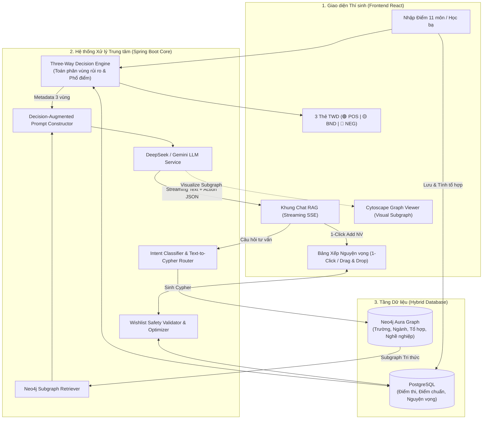

# 🗺️ TÀI LIỆU ĐẶC TẢ & BREAKDOWN TÍNH NĂNG: GRAPH-RAG + TWD + SMART WISHLIST

> **Dự án**: AdmissionKG — Hệ thống Khám phá Tri thức & Tư vấn Tuyển sinh Đại học Thông minh  
> **Phiên bản**: 1.0.0  
> **Mục tiêu**: Xây dựng hệ sinh thái khép kín: **Phân tích Rủi ro 3 vùng (TWD) $\rightarrow$ Lập luận Đồ thị Tri thức (Graph RAG) $\rightarrow$ Hỗ trợ Đăng ký & Tối ưu hóa Nguyện vọng (Smart Wishlist)**.

---

## 🏛️ 1. TỔNG QUAN KIẾN TRÚC & LUỒNG DỮ LIỆU (END-TO-END WORKFLOW)

---

## 🧩 2. CHI TIẾT CÁC EPIC & MODULE BREAKDOWN

### 📌 EPIC 1: BỘ MÁY PHÂN LOẠI 3 VÙNG (TWD CORE ENGINE)

**Mục tiêu**: Xây dựng thuật toán quyết định 3 vùng (Three-Way Decision) dựa trên xác suất trúng tuyển và phổ điểm thi THPT quốc gia.

* **Task 1.1: Service Tính toán Tổ hợp Môn Tự động (Combination Scoring)**
  * Nhận điểm 11 môn thi THPT (Toán, Văn, Lý, Hóa, Sinh, Sử, Địa, GDCD/KTPL, Tin học, Công nghệ, Ngoại ngữ).
  * Tự động tính điểm quy đổi cho 191 tổ hợp môn (A00, A01, B00, C00, D01,...).
  * Cộng điểm ưu tiên đối tượng (0 - 2.0đ) và ưu tiên khu vực (KV1: 0.75, KV2-NT: 0.5, KV2: 0.25, KV3: 0) theo đúng quy chế giảm dần từ 22.5 điểm của Bộ GD&ĐT.
* **Task 1.2: Mô hình Toán Three-Way Decision ($\alpha, \beta$)**
  * Thiết lập ma trận tổn thất chi phí (Cost Matrix $\lambda$) cho quyết định tuyển sinh:
    * Chấp nhận (Positive - Đặt NV1/NV2): Lợi ích khi đỗ đúng ngành yêu thích.
    * Từ chối (Negative - Loại bỏ): Tránh lãng phí nguyện vọng vào ngành không có cơ hội.
    * Trì hoãn/Cân nhắc (Boundary - Đặt NV phòng ngừa): Chờ thêm thông tin phổ điểm.
  * Công thức tính khoảng cách điểm an toàn: $\Delta = S_{\text{thí sinh}} - S_{\text{chuẩn\_năm\_trước}}$ kết hợp hệ số điều chỉnh độ lệch phổ điểm $\delta_{\text{phổ\_điểm}}$:
    * 🟢 **Vùng POS (Chắc chắn đỗ)**: $\Delta \ge +1.0$ điểm (hoặc $\text{Rank} \le \text{Quota}$).
    * 🟡 **Vùng BND (Vừa sức / Cân nhắc)**: $-0.75 \le \Delta < +1.0$ điểm.
    * 🔴 **Vùng NEG (Rủi ro cao)**: $\Delta < -0.75$ điểm.
* **Task 1.3: REST API Phân tích TWD**
  * `POST /api/v1/twd/evaluate`: Đánh giá danh sách các ngành phù hợp theo điểm thí sinh.
  * `GET /api/v1/twd/matrix/{userId}`: Trả về ma trận 3 vùng phục vụ hiển thị Dashboard.

---

### 📌 EPIC 2: ĐỒ THỊ TRI THỨC & TEXT-TO-CYPHER ENGINE (NEO4J)

**Mục tiêu**: Khai thác đồ thị liên kết đa chiều giữa Trường - Ngành - Tổ hợp - Điểm chuẩn - Nghề nghiệp để cung cấp ngữ cảnh chính xác cho RAG.

* **Task 2.1: Chuẩn hóa Graph Schema trên Neo4j**
  * Node Labels: `(:Institution)`, `(:AdmissionTrack)`, `(:Major)`, `(:SubjectCombination)`, `(:AdmissionMethod)`, `(:Career)`.
  * Relationship Types:
    * `(:Institution)-[:OFFERS {year: 2026, quota: 150}]->(:AdmissionTrack)`
    * `(:AdmissionTrack)-[:ACADEMIC_MAJOR]->(:Major)`
    * `(:AdmissionTrack)-[:APPLIES_METHOD]->(:AdmissionMethod)`
    * `(:AdmissionTrack)-[:ACCEPTS_COMBO]->(:SubjectCombination)`
    * `(:AdmissionTrack)-[:HAS_BENCHMARK {year: 2025, score: 24.5}]->(:SubjectCombination)`
    * `(:Major)-[:LEADS_TO]->(:Career)`
* **Task 2.2: Intent Classifier & Cypher Query Generator**
  * Phân loại ý định người dùng thành 4 nhóm chính:
    1. `QUERY_BENCHMARK`: Tra cứu điểm chuẩn lịch sử & xu hướng tăng/giảm.
    2. `QUERY_COMBO_METHOD`: Hỏi về môn xét tuyển, phương thức đánh giá năng lực, học bạ.
    3. `QUERY_CAREER_TUITION`: Hỏi về cơ hội việc làm, học phí, chính sách miễn học phí Sư phạm NĐ 116.
    4. `ADVICE_STRATEGY`: Yêu cầu tư vấn chiến lược xếp thứ tự nguyện vọng theo điểm số cá nhân.
  * Sinh câu truy vấn Cypher an toàn (Parameterized Cypher) để trích xuất Subgraph liên quan ($\le 2$ hops).
* **Task 2.3: Subgraph Context Formatter**
  * Trích xuất kết quả từ Neo4j và định dạng thành bảng tóm tắt tri thức dạng Markdown/JSON để nạp vào Context Window của LLM.

---

### 📌 EPIC 3: GRAPH-RAG PIPELINE & DECISION-AUGMENTED PROMPTING

**Mục tiêu**: Ghép nối Subgraph tri thức + Phân vùng TWD vào LLM DeepSeek để đưa ra lời khuyên tuyển sinh có tính giải thích cao và định dạng dữ liệu có cấu trúc.

* **Task 3.1: Bộ dựng Prompt Tích hợp Quyết định (Decision-Augmented System Prompt)**
  * Cấu trúc Prompt gồm 4 phần:
    1. **Role & Persona**: Chuyên gia Cố vấn Tuyển sinh Đại học Việt Nam (hiểu rõ quy chế xét tuyển THPT, phương thức xét tuyển thẳng, thứ tự ưu tiên NV).
    2. **Candidate Context**: Điểm thi 11 môn, các tổ hợp thế mạnh, khu vực ưu tiên, phân loại 3 vùng TWD (🟢/🟡/🔴).
    3. **Knowledge Graph Grounding**: Dữ liệu chuẩn xác từ Neo4j (Điểm chuẩn năm trước, chỉ tiêu 2026, học phí, nghề nghiệp).
    4. **Output Constraints**: Định dạng phản hồi kèm Block JSON chứa danh sách Action (`add_wishlist`, `view_track_details`).
* **Task 3.2: SSE Streaming & Hybrid Response Handler**
  * Triển khai Server-Sent Events (`text/event-stream`) tại `/api/v1/chat/stream`:
    * Chữ phản hồi được stream mượt mà theo thời gian thực.
    * Sự kiện `event: action_payload` gửi kèm danh sách card nguyện vọng và node đồ thị để render đồng thời.
* **Task 3.3: Lọc Chống Ảo giác (Anti-Hallucination Guardrail)**
  * Kiểm duyệt sau sinh (Post-generation Validator): Đối chiếu mọi mã ngành, mã trường được AI đề xuất với Database. Nếu mã không tồn tại, tự động sửa hoặc gắn cờ cảnh báo.

---

### 📌 EPIC 4: GIAO DIỆN SPLIT-SCREEN DASHBOARD & SMART WISHLIST

**Mục tiêu**: Xây dựng trải nghiệm người dùng tương tác đa màn hình: vừa chat với AI, vừa thấy ma trận 3 vùng TWD, vừa kéo thả sắp xếp danh sách nguyện vọng.

* **Task 4.1: Màn hình Split-Screen Dashboard (Mô-đun `/chat`)**
  * **Cột Trái (40%)**: Giao diện Chat Messenger thông minh với AI (gợi ý câu hỏi nhanh, streaming text, markdown đẹp mắt).
  * **Cột Phải - Tab 1 (60%)**: 3 Thẻ phân vùng TWD trực quan (🟢 An toàn, 🟡 Cân nhắc, 🔴 Rủi ro) tự động cập nhật theo ngữ cảnh đang chat.
  * **Cột Phải - Tab 2**: Bảng Xếp Nguyện Vọng Thông Minh (Smart Wishlist).
  * **Cột Phải - Tab 3**: Trình khám phá Đồ thị Tri thức tương tác (Cytoscape.js Explorer).
* **Task 4.2: Thẻ Hành động 1-Click (1-Click Wishlist Action Cards)**
  * Ngay trong tin nhắn của AI, hiển thị card đề xuất kèm nút **`+ Thêm vào Nguyện vọng 1 / 2 / 3`**.
  * Bấm nút sẽ tự động thêm ngành vào Bảng Nguyện vọng mà không cần chuyển trang.
* **Task 4.3: Bảng Xếp Nguyện Vọng Kèm Bộ Kiểm Tra An Toàn (Safety Validator)**
  * Hỗ trợ kéo-thả (Drag & Drop) thay đổi thứ tự ưu tiên NV1, NV2, NV3,...
  * **Thuật toán Kiểm tra An toàn (Safety Rules)**:
    * ⚠️ Cảnh báo nếu toàn bộ NV đều nằm ở vùng Đỏ 🔴 (nguy cơ trượt đại học).
    * ⚠️ Cảnh báo nếu xếp NV vùng Xanh 🟢 lên trên NV vùng Vàng 🟡 (lãng phí cơ hội đỗ ngành mơ ước).
    * 💡 Gợi ý tỷ lệ vàng phân bổ nguyện vọng: 20-30% Mơ ước (BND), 50% Vừa sức (BND/POS), 20-30% Phòng hộ tuyệt đối (POS).

---

### 📌 EPIC 5: KHUNG KIỂM THỬ 4 TẦNG & ĐÁNH GIÁ THỰC NGHIỆM (EVALUATION FRAMEWORK)

**Mục tiêu**: Xây dựng bộ công cụ kiểm thử toàn diện để đo lường độ chính xác và cung cấp số liệu thực nghiệm cho Báo cáo Khóa luận Tốt nghiệp.

* **Task 5.1: Bộ Unit Test Kiểm thử Thuật toán Số học TWD**
  * Viết 20+ Unit Tests JUnit 5 kiểm tra tính đúng đắn của công thức tính điểm tổ hợp và phân vùng 3 vùng với các ngưỡng biên.
* **Task 5.2: Bộ Kiểm tra Ràng buộc Bất biến (Safety Invariants Tests)**
  * Tự động kiểm tra câu trả lời của AI: 100% mã trường/ngành phải có thật, không bao giờ khuyên thí sinh đặt 100% NV rủi ro.
* **Task 5.3: Pipeline Đánh giá Tự động (LLM-as-a-Judge với Ragas Metric)**
  * Đo lường 4 chỉ số: *Faithfulness*, *Answer Relevance*, *Strategic Soundness*, *Explainability*.
* **Task 5.4: Bộ 50 Persona Benchmark Test Cases**
  * Xây dựng 50 kịch bản hồ sơ thí sinh mẫu (Điểm xuất sắc, điểm trung bình, điểm sát sàn, thí sinh tự do, thí sinh chuyển khối thi) để chạy thực nghiệm và xuất bảng so sánh số liệu.

---

## 🗓️ 3. LỘ TRÌNH TRIỂN KHAI & TIẾN ĐỘ CHI TIẾT (MILESTONES)

| Chặng | Hạng mục công việc trọng tâm | Thời gian dự kiến | Đầu ra kiểm thử (Deliverables) |
| :---: | :--- | :---: | :--- |
| **Giai đoạn 1** | **Xây dựng TWD Engine & API Tính điểm Tổ hợp** | 3 - 4 ngày | JUnit Test 100% Pass, API `/api/v1/twd/evaluate` trả về đúng 3 vùng 🟢/🟡/🔴. |
| **Giai đoạn 2** | **Tích hợp Neo4j Cypher & Graph-RAG Pipeline** | 4 - 5 ngày | API `/api/v1/chat/stream` stream câu trả lời có trích dẫn dữ liệu chuẩn từ Neo4j. |
| **Giai đoạn 3** | **Xây dựng Giao diện Chat Dashboard & Smart Wishlist** | 4 - 5 ngày | Màn hình Split-Screen, thẻ 3 vùng TWD, kéo thả nguyện vọng, 1-Click Action. |
| **Giai đoạn 4** | **Chạy Thực nghiệm Bộ 50 Persona & Viết Báo cáo** | 3 ngày | Bảng số liệu thực nghiệm, độ chính xác phân vùng, biểu đồ đánh giá cho Khóa luận. |

---

## 🎯 4. TIÊU CHÍ NGHIỆM THU (ACCEPTANCE CRITERIA)

1. **Độ chính xác Toán học (TWD Accuracy)**: Thuật toán phân vùng 3 vùng đạt độ chính xác $100\%$ so với công thức lý thuyết.
2. **Độ trung thực dữ liệu (Zero Hallucination on KG Data)**: $100\%$ điểm chuẩn, mã ngành, mã trường trong lời khuyên của AI trùng khớp tuyệt đối với CSDL.
3. **Tính hành động (Actionability)**: Thí sinh có thể chuyển đổi trực tiếp lời khuyên của AI thành Danh sách Nguyện vọng chỉ bằng 1 cú click chuột.
4. **Hiệu năng thời gian thực**: Thời gian phản hồi Token đầu tiên (Time-to-First-Token) của AI Streaming $< 1.5$ giây.
