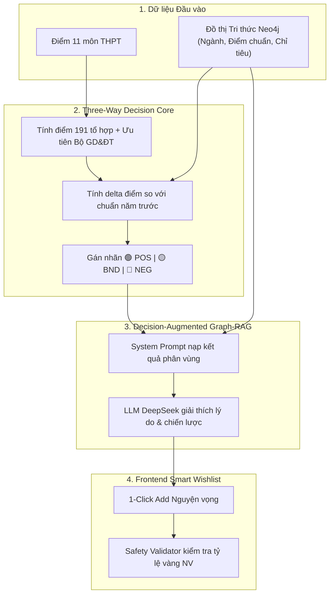

# 🔬 BÀI TOÁN PHÂN TÍCH CHUYÊN SÂU & MÔ HÌNH TOÁN HỌC: THREE-WAY DECISION (TWD)

> **Feature**: Phân loại Nguyện vọng 3 vùng (Three-Way Decision Engine) & Tính toán Điểm tổ hợp  
> **Epic**: EPIC-01 (TWD Core Engine)  
> **Tài liệu phương pháp luận**: Spec-Driven Development (SDD) — Bước 0: Problem Analysis  

---

## 📌 1. BỐI CẢNH THỰC TẾ & VẤN ĐỀ CỦA THÍ SINH (PROBLEM STATEMENT)

### 1.1. Nỗi đau thực tế trong mùa tuyển sinh
Mỗi mùa tuyển sinh có hơn 1.000.000 thí sinh đăng ký xét tuyển đại học. Thí sinh phải đối mặt với các rủi ro lớn:
1. **Rủi ro "Trượt trắng" (Under-placement / Rejection)**: Đặt toàn bộ nguyện vọng vào các ngành có điểm chuẩn cao hơn năng lực thực tế.
2. **Rủi ro "Lãng phí điểm số" (Over-placement / Regret)**: Điểm rất cao (ví dụ 27.0đ) nhưng đặt ngay Nguyện vọng 1 vào ngành lấy 18.0đ, làm mất cơ hội trúng tuyển vào các trường đại học top đầu (Bách Khoa, Y Dược, Ngoại Thương,...).
3. **Sự thiếu thông tin về Độ lệch Phổ điểm & Điểm ưu tiên**: Thí sinh không biết cách tự tính điểm ưu tiên bị chiết khấu giảm dần từ 22.5 điểm của Bộ GD&ĐT và không lượng hóa được xác suất đỗ khi chỉ nhìn vào 1 mốc điểm chuẩn của năm ngoái.

### 1.2. Mục tiêu của Hệ thống
Cung cấp một **Mô hình Ra quyết định 3 vùng (Three-Way Decision)** có căn cứ khoa học:
* 🟢 **Vùng POS (Chấp nhận - An toàn)**: Ngành thí sinh có xác suất đỗ cao ($\ge 85\%$). Thích hợp làm **Nguyện vọng bảo hiểm / phòng hộ**.
* 🟡 **Vùng BND (Cân nhắc / Vùng biên)**: Ngành có tính cạnh tranh cao ($50\% - 84\%$), phụ thuộc biến động chỉ tiêu. Thích hợp làm **Nguyện vọng mục tiêu / mơ ước (NV1, NV2)**.
* 🔴 **Vùng NEG (Từ chối / Rủi ro cao)**: Ngành có điểm chuẩn vượt quá năng lực ($< 50\%$). Hệ thống cảnh báo để tránh lãng phí thứ tự nguyện vọng.

---

## 📐 2. KHÔNG GIAN BÀI TOÁN & CÁC BIẾN SỐ (MATHEMATICAL FORMULATION)

### 2.1. Biến số đầu vào (Inputs)
* **Tập điểm thi 11 môn của thí sinh**:  
  $$\mathbf{E} = \{e_{\text{Toán}}, e_{\text{Văn}}, e_{\text{Lý}}, e_{\text{Hóa}}, e_{\text{Sinh}}, e_{\text{Sử}}, e_{\text{Địa}}, e_{\text{GDCD}}, e_{\text{Tin}}, e_{\text{CN}}, e_{\text{Ngoại ngữ}}\} \quad \text{với } e_i \in [0.0, 10.0] \cup \{\text{null}\}$$
* **Hồ sơ ưu tiên**:  
  * Nhóm đối tượng ưu tiên: $U_T \in \{\text{UT1} (2.0\text{đ}), \text{UT2} (1.0\text{đ}), \text{None} (0\text{đ})\}$.  
  * Khu vực tuyển sinh: $K_V \in \{\text{KV1} (0.75\text{đ}), \text{KV2-NT} (0.5\text{đ}), \text{KV2} (0.25\text{đ}), \text{KV3} (0\text{đ})\}$.
* **Điểm chuẩn tham chiếu ngành $j$ qua các năm**: $S_{\text{ref}}(j) \in [15.0, 30.0]$.

---

### 2.2. Công thức Điểm Xét tuyển Cá nhân hóa ($S_{\text{total}}$)

#### Bước A: Tính Điểm thô 3 môn theo Tổ hợp môn $c$
$$S_{\text{raw}}(c) = \sum_{m \in \text{Subjects}(c)} e_m \quad (\text{với } S_{\text{raw}} \in [0.0, 30.0])$$

#### Bước B: Công thức Tính Điểm ưu tiên Chiết khấu của Bộ GD&ĐT
Điểm ưu tiên danh nghĩa: $P_{\text{base}} = P(U_T) + P(K_V)$.  
Điểm ưu tiên thực tế áp dụng:
$$P_{\text{actual}}(c) = \begin{cases} 
P_{\text{base}}, & \text{nếu } S_{\text{raw}}(c) < 22.5 \\
P_{\text{base}} \times \left( \dfrac{30 - S_{\text{raw}}(c)}{7.5} \right), & \text{nếu } S_{\text{raw}}(c) \ge 22.5 
\end{cases}$$

#### Bước C: Tổng điểm xét tuyển
$$S_{\text{final}}(c) = \min\left(30.0, \, S_{\text{raw}}(c) + P_{\text{actual}}(c)\right)$$

---

### 2.3. Mô hình Quyết định 3 Vùng (Rough Set Based Three-Way Decision)

Gọi trạng thái thực tế của việc nộp hồ sơ vào ngành $j$ là $C = \{C_{\text{Đỗ}}, C_{\text{Trượt}}\}$.  
Tập hành động quyết định của hệ thống: $\mathcal{A} = \{a_P (\text{Chọn POS}), a_B (\text{Cân nhắc BND}), a_N (\text{Loại bỏ NEG})\}$.

#### Ma trận Tổn thất Chi phí (Cost Loss Matrix $\lambda$):

| Trạng thái / Hành động | $a_P$ (Khuyên đặt POS) | $a_B$ (Khuyên đặt BND) | $a_N$ (Khuyên loại NEG) |
| :--- | :---: | :---: | :---: |
| **$C_{\text{Đỗ}}$ (Thực tế đỗ)** | $\lambda_{PP}$ *(Tổn thất 0: đỗ đúng kỳ vọng)* | $\lambda_{BP}$ *(Tốn thêm chi phí cân nhắc)* | $\lambda_{NP}$ *(Tổn thất cực lớn: bỏ lỡ ngành đỗ)* |
| **$C_{\text{Trượt}}$ (Thực tế trượt)** | $\lambda_{PN}$ *(Tổn thất rất lớn: trượt ĐH)* | $\lambda_{BN}$ *(Tổn thất trung bình)* | $\lambda_{NN}$ *(Tổn thất 0: tránh được trượt)* |

Với điều kiện ràng buộc kinh điển của TWD:  
$$\lambda_{PP} \le \lambda_{BP} < \lambda_{NP} \quad \text{và} \quad \lambda_{NN} \le \lambda_{BN} < \lambda_{PN}$$

#### Xác định Cặp Ngưỡng Quyết định $(\alpha, \beta)$:
$$\alpha = \frac{\lambda_{PN} - \lambda_{BN}}{(\lambda_{PN} - \lambda_{BN}) + (\lambda_{BP} - \lambda_{PP})}, \qquad \beta = \frac{\lambda_{BN} - \lambda_{NN}}{(\lambda_{BN} - \lambda_{NN}) + (\lambda_{NP} - \lambda_{BP})}$$
Với $0 < \beta < \alpha < 1$.

#### Hàm Phân vùng Thực tiễn dựa trên Khoảng cách Điểm ($\Delta$):
Khoảng chênh lệch: $\Delta(j, c) = S_{\text{final}}(c) - S_{\text{ref}}(j)$

$$\text{Decision}(j) = \begin{cases}
\mathbf{POS} \text{ (🟢 Vùng An toàn)}, & \text{khi } \Delta(j, c) \ge +1.0 \text{ điểm} \quad \left(P(C_{\text{Đỗ}}) \ge \alpha \approx 0.85\right) \\
\mathbf{BND} \text{ (🟡 Vùng Cân nhắc)}, & \text{khi } -0.75 \le \Delta(j, c) < +1.0 \text{ điểm} \quad \left(\beta \le P(C_{\text{Đỗ}}) < \alpha\right) \\
\mathbf{NEG} \text{ (🔴 Vùng Rủi ro)}, & \text{khi } \Delta(j, c) < -0.75 \text{ điểm} \quad \left(P(C_{\text{Đỗ}}) < \beta \approx 0.50\right)
\end{cases}$$

---

## 🔗 3. MỐI LIÊN KẾT: TWD $\rightarrow$ GRAPH-RAG $\rightarrow$ SMART WISHLIST

---

## 🏁 4. KẾT LUẬN & ĐẦU RA BƯỚC PHÂN TÍCH
* Thuật toán toán học đã được chuẩn hóa công thức rõ ràng.
* Sẵn sàng chuyển sang **Bước 2: Viết bộ Unit Test JUnit 5 (TDD)** theo đúng các công thức và ngưỡng $(\alpha, \beta)$ nêu trên.
